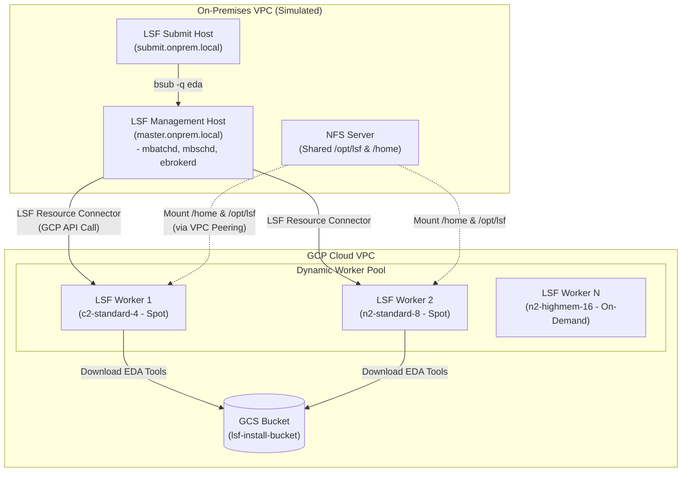

# Hybrid LSF EDA Environment: On-Premise to GCP Cloud Bursting

This repository serves as a blueprint and configuration reference to help customers launch and configure a hybrid Electronic Design Automation (EDA) environment. It demonstrates how an on-premises semiconductor design team can leverage **IBM Spectrum LSF** and the **LSF Resource Connector** to burst EDA workloads into **Google Cloud Platform (GCP)**.

The environment is configured to run a complete, modern open-source EDA toolchain on dynamically provisioned GCP Compute Engine instances:
*   **Icarus Verilog (`iverilog`)**: Simulation & verification.
*   **Yosys**: RTL synthesis.
*   **Verilator**: High-performance cycle-accurate simulation.
*   **OpenROAD**: Automated RTL-to-GDSII physical design (placement & routing).
*   **Magic**: VLSI layout editor and Design Rule Checking (DRC).
*   **Netgen**: Layout vs. Schematic (LVS) netlist comparison.
*   **GTKWave**: Waveform viewer for analyzing simulation VCD dumps.

---

## Table of Contents
1. [IBM Spectrum LSF Licensed Software Requirements](#1-ibm-spectrum-lsf-licensed-software-requirements)
2. [Hybrid Cloud Architecture](#2-hybrid-cloud-architecture)
3. [Environment Blueprint](#3-environment-blueprint)
4. [Deployment & Setup Guide](#4-deployment--setup-guide)
5. [Cluster Verification & Functional Demonstrations](#5-cluster-verification--functional-demonstrations)

---

## 1. IBM Spectrum LSF Licensed Software Requirements

> [!IMPORTANT]
> **IBM Spectrum LSF is proprietary licensed software owned by IBM**. 
> 
> **No LSF installer packages, distribution binaries, or license entitlement files are bundled in this repository.** Customers and users are responsible for obtaining their own valid IBM Spectrum LSF 10.1 software packages and cluster entitlement files from their IBM Passport Advantage account or authorized IBM representative.

If you are performing a fresh installation from scratch (rather than deploying from pre-built Golden Images), you must create a local `Install_Files/` directory in the root of this repository and supply the following 4 customer-provided archives before running the upload and setup scripts:

| Customer-Supplied Filename                         | Required / Optional | Description |
| :------------------------------------------------- | :------------------ | :--- |
| **`lsf_std_entitlement.dat`**                      | **Required**        | Customer's Standard Edition cluster license entitlement file. |
| **`lsf10.1_lsfinstall_linux_x86_64.tar.Z`**        | **Required**        | LSF 10.1 base installer execution scripts and configuration wizards. |
| **`lsf10.1_lnx310-lib217-x86_64.tar.Z`**            | **Required**        | Core LSF 10.1 distribution binaries for Linux (x86_64). |
| **`lsf10.1_lnx310-lib217-x86_64-602430.tar.Z`**    | *Recommended*       | Cumulative LSF Service Pack 15 (SP15) binary update package. |

*(Note: If you are deploying the cluster using pre-built **Golden Images** where LSF binaries have already been pre-installed into the VM disk image, the `Install_Files/` directory is not needed.)*

---

## 2. Hybrid Cloud Architecture

The hybrid cloud environment replicates a classic enterprise setup:
- **On-Premise (Simulated)**: A dedicated VPC (`onprem-vpc`) hosting the LSF Management (Master) node and an LSF Submission/Login host. This represents the physical data center.
- **GCP Cloud**: A separate VPC (`cloud-vpc`) where the LSF Resource Connector dynamically provisions worker nodes in response to pending jobs.
- **Connectivity**: The two VPCs are connected via **VPC Network Peering**, enabling private, secure, low-latency communication.



### 2.1 Provisioned Infrastructure & Cluster Components

When you deploy this environment, the Terraform configurations and LSF setup scripts automatically build the following components:

*   **LSF Management Host (`master`)**: A virtual machine in the simulated on-prem network running the LSF core scheduling daemons (`lim`, `res`, `sbatchd`, `mbatchd`, `mbschd`) and the Resource Connector broker daemon (`ebrokerd`).
*   **LSF Submission Host (`submit`)**: A virtual machine serving as the user login node from which design engineers submit and monitor batch workloads.
*   **Shared NFS Server**: Configured directly on the Master VM, this exports and shares the `/opt/lsf` binaries and `/home` directories across peered VPC networks to all dynamic workers.
*   **GCS Storage Bucket**: A secure Google Cloud Storage bucket that holds the LSF installation packages and setup configs for worker node provisioning.
*   **Dynamic Worker Pool**: GCE virtual machines (e.g. `compute-*`) spun up on-demand by the LSF Resource Connector, running Rocky Linux 8 and pre-configured to mount `/opt/lsf` and `/home` over the network on boot.
*   **VPC Peering & Cloud DNS Peering**: Peers the simulated on-prem and cloud VPCs together with private IP routing. It also configures Cloud DNS Peering (forward and reverse zones) to enable private hostname resolution between the networks, allowing dynamic cloud workers to resolve and communicate with the on-prem Master (and vice-versa) over secure firewall rules mapped to LSF ports (`7869`, `6878`, `6882`) and NFS (`2049`).

---

### 3. Environment Blueprint

To set up and validate this environment, the repository provides two core functional testing suites and supporting infrastructure:
1. **Terraform Infrastructure** ([terraform/](terraform)): Automates VPCs, Subnets, VPC Peering, Cloud NAT, Cloud DNS Peering, IAM Service Accounts, GCS Buckets, and simulated On-Premises LSF Master and Submit VMs.
2. **LSF Configurations** ([lsf_config/](lsf_config)): Configurations for the LSF cluster, including Resource Connector templates customized for dynamic GCP cloud bursting.
3. **Component 1: Cloud Auto-Scaling Suite** ([submit_scripts/](submit_scripts)): Contains job submission scripts and real-time monitoring tools designed to test concurrent dynamic scaling limits (such as launching 10 instances / 20 slots simultaneously and watching them terminate when idle).
4. **Component 2: Parallel EDA Workloads & Regressions** ([eda_workflow/](eda_workflow)): A sample semiconductor digital design project (Verilog counter, self-checking testbench, Yosys synthesis, and 100-task parallel regression sweep) to verify real hardware design tools across the cluster.
5. **Golden Image Guide** ([GOLDEN_IMAGE.md](GOLDEN_IMAGE.md)): Complete instructions and automation scripts to build the custom GCE worker image pre-loaded with open-source EDA toolchains.

---

## 4. Deployment & Setup Guide

### Step 4.0: Google Cloud Authentication Setup
Before deploying, ensure your local `gcloud` CLI and Application Default Credentials (ADC) sessions are authenticated to your GCP project:
```bash
gcloud auth login
gcloud auth application-default login
```

### Step 4.0b: Run Pre-Flight Checks
Next, run our automated pre-flight check script to verify that your CLI tools, active authentication sessions (CLI & ADC), project APIs, and LSF installer archives are ready:
```bash
./preflight.sh YOUR_GCP_PROJECT_ID
```
Example successful output:
```text
==================================================
LSF Hybrid Cloud: Pre-Flight Check
==================================================
1. Checking required CLI tools (terraform, gcloud)... PASSED
2. Checking Google Cloud authentication & ADC token... PASSED
3. Checking access to GCP Project 'YOUR_GCP_PROJECT_ID'... PASSED
4. Verifying required GCP APIs (compute, iam, storage)...
   -> API enabled: compute.googleapis.com
   -> API enabled: iam.googleapis.com
   -> API enabled: storage.googleapis.com
   -> API enabled: iamcredentials.googleapis.com
5. Checking for customer-supplied LSF installer archives in Install_Files/... PASSED (or SKIPPED if using Golden Images)
==================================================
ALL PRE-FLIGHT CHECKS PASSED!
You are ready to deploy: cd terraform && terraform apply -var="project_id=YOUR_GCP_PROJECT_ID"
==================================================
```
*If your credentials have expired or required APIs are disabled, the script will catch it immediately and instruct you on how to resolve it before running Terraform.*

### Step 4.1: Deploy the Cloud Infrastructure
1. Navigate to the `terraform` directory:
   ```bash
   cd terraform
   ```
2. Initialize Terraform and apply the plan:
   ```bash
   terraform init
   ```
   ```bash
   terraform apply -var="project_id=YOUR_GCP_PROJECT_ID"
   ```
This will output the public IP of the LSF Master and Submit hosts.

##### Running with Pre-Built Golden Images (Production Flow)
If you have already built LSF custom golden images in your GCP project, you can specify them as variables during the apply stage to boot both the Master and Submit VMs directly from your pre-configured images:
```bash
terraform apply \
  -var="project_id=YOUR_GCP_PROJECT_ID" \
  -var="master_image=lsf-master-rocky-8-image" \
  -var="submit_image=lsf-submit-and-worker-rocky-8-image" \
  -var="worker_image=lsf-submit-and-worker-rocky-8-image"
```
*Note: If these custom images do not exist in your GCP project yet, omit the `master_image`, `submit_image`, and `worker_image` variables. Terraform will default to public Rocky 8 images and automatically install all dependencies during VM boot.*

### Step 4.1b: Using Existing VPCs (Optional)
By default, the provided Terraform scripts automatically **create two new VPCs from scratch** (`lsf-onprem-vpc` and `lsf-cloud-vpc`) and peer them together. If you prefer to deploy into **existing VPC networks**, make the following 3 adjustments before running:
1. **In LSF Resource Connector Templates ([`lsf_config/googleprov_templates.json`](lsf_config/googleprov_templates.json))**:
   Update the `"vpc"` and `"subnetId"` fields across all templates to match your existing GCP network and subnetwork names:
   ```json
   "vpc": "your-existing-vpc-name",
   "subnetId": "your-existing-subnet-name"
   ```
2. **In LSF Cluster Address Rules ([`lsf_config/lsf.cluster.eda_cluster`](lsf_config/lsf.cluster.eda_cluster))**:
   Update `LSF_HOST_ADDR_RANGE` to include the CIDR range of your existing subnet(s) so LSF allows dynamic worker VMs from that network to join:
   ```ini
   LSF_HOST_ADDR_RANGE = 10.0.* 192.168.*
   ```
3. **In Firewall Rules**:
   Ensure your existing VPC has firewall rules allowing TCP/UDP port `7869` (LIM), TCP port `6878` (RES), TCP port `6882` (sbatchd), and TCP port `2049` (NFS) between your LSF Master/Submit hosts and the cloud worker subnet.

### Step 4.2: Upload LSF Installers & Configs to GCS Bucket
We have provided an automated upload script ([`upload_assets.sh`](upload_assets.sh)) that retrieves the bucket name directly from Terraform and handles the entire upload process using the fast Google Cloud Storage CLI.
From the project root directory, run:
```bash
./upload_assets.sh
```
Example successful output (when using pre-built Golden Images):
```text
==================================================
LSF Hybrid Cloud: Uploading Assets to GCS
==================================================
Retrieving GCS bucket name from Terraform state...
Target bucket: gs://lsf-install-bucket-xxxxxx
Checking LSF installation status on master VM...
 -> LSF is already installed on master VM. Skipping installer upload.
--- Skipping LSF installers upload block ---
Uploading LSF configuration directory...
Copying file://lsf_config/user_data.sh to gs://lsf-install-bucket-xxxxxx/lsf_config/user_data.sh
Copying file://lsf_config/lsb.resources to gs://lsf-install-bucket-xxxxxx/lsf_config/lsb.resources
Copying file://lsf_config/lsb.hosts to gs://lsf-install-bucket-xxxxxx/lsf_config/lsb.hosts
Copying file://lsf_config/lsf.conf to gs://lsf-install-bucket-xxxxxx/lsf_config/lsf.conf
Copying file://lsf_config/lsb.modules to gs://lsf-install-bucket-xxxxxx/lsf_config/lsb.modules
Copying file://lsf_config/lsb.queues to gs://lsf-install-bucket-xxxxxx/lsf_config/lsb.queues
Copying file://lsf_config/googleprov_templates.json to gs://lsf-install-bucket-xxxxxx/lsf_config/googleprov_templates.json
Copying file://lsf_config/googleprov_config.json to gs://lsf-install-bucket-xxxxxx/lsf_config/googleprov_config.json
Copying file://lsf_config/build_golden_image.sh to gs://lsf-install-bucket-xxxxxx/lsf_config/build_golden_image.sh
Copying file://lsf_config/lsf.shared to gs://lsf-install-bucket-xxxxxx/lsf_config/lsf.shared
Copying file://lsf_config/hostProviders.json to gs://lsf-install-bucket-xxxxxx/lsf_config/hostProviders.json
Copying file://lsf_config/lsf.cluster.eda_cluster to gs://lsf-install-bucket-xxxxxx/lsf_config/lsf.cluster.eda_cluster
Copying file://lsf_config/setup_master.sh to gs://lsf-install-bucket-xxxxxx/lsf_config/setup_master.sh
  Completed files 13/13 | 25.3kiB/25.3kiB

Average throughput: 175.6kiB/s
Uploading EDA sample workflow directory...
Copying file://eda_workflow/submit_regression.sh to gs://lsf-install-bucket-xxxxxx/eda_workflow/submit_regression.sh
Copying file://eda_workflow/synthesis.ys to gs://lsf-install-bucket-xxxxxx/eda_workflow/synthesis.ys
Copying file://eda_workflow/submit_eda_job.sh to gs://lsf-install-bucket-xxxxxx/eda_workflow/submit_eda_job.sh
Copying file://eda_workflow/run_eda_job.sh to gs://lsf-install-bucket-xxxxxx/eda_workflow/run_eda_job.sh
Copying file://eda_workflow/run_regression_task.sh to gs://lsf-install-bucket-xxxxxx/eda_workflow/run_regression_task.sh
Copying file://eda_workflow/counter.v to gs://lsf-install-bucket-xxxxxx/eda_workflow/counter.v
Copying file://eda_workflow/counter_tb.v to gs://lsf-install-bucket-xxxxxx/eda_workflow/counter_tb.v
  Completed files 7/7 | 8.1kiB/8.1kiB

Average throughput: 58.9kiB/s
Uploading Submit & Scaling test scripts directory...
Copying file://submit_scripts/scale_10_job.sh to gs://lsf-install-bucket-xxxxxx/submit_scripts/scale_10_job.sh
Copying file://submit_scripts/submit_scale_10.sh to gs://lsf-install-bucket-xxxxxx/submit_scripts/submit_scale_10.sh
Copying file://submit_scripts/monitor_scaling.sh to gs://lsf-install-bucket-xxxxxx/submit_scripts/monitor_scaling.sh
  Completed files 3/3 | 3.1kiB/3.1kiB

==================================================
ALL ASSETS UPLOADED SUCCESSFULLY TO:
gs://lsf-install-bucket-xxxxxx/
==================================================
```

### Step 4.3: Install & Configure the LSF Master (On-Prem)
We have provided an automated installation script ([`lsf_config/setup_master.sh`](lsf_config/setup_master.sh)) that silently installs LSF, applies the EDA and GCP Resource Connector configurations, and starts the cluster daemons.
1. SSH into the LSF Master VM (using IAP TCP forwarding for internal-only VMs):
   ```bash
   gcloud compute ssh lsf-master --zone=us-central1-a --tunnel-through-iap
   ```
2. Download the configuration folder from GCS and run the automated setup script:
   ```bash
   BUCKET_NAME=$(curl -s -H "Metadata-Flavor: Google" http://metadata.google.internal/computeMetadata/v1/instance/attributes/lsf_bucket)
   gcloud storage cp -r gs://$BUCKET_NAME/lsf_config ./
   sudo bash ./lsf_config/setup_master.sh
   ```
3. Once the script finishes, source your LSF environment and verify that the master host is up and accepting jobs:
   ```bash
   source /opt/lsf/conf/profile.lsf
   lsid
   bhosts
   ```

#### About the `setup_master.sh` Script & Daemon Management

The [`lsf_config/setup_master.sh`](lsf_config/setup_master.sh) script handles the complete bootstrapping of the LSF Master node:
1.  **Extracts LSF binaries**: Automates the base installation and applies cumulative Service Pack 15 patches silently (skipped automatically if pre-installed Golden Images are used).
2.  **Applies Cluster Configurations**: Configures queues, resource limits, host metrics, and dynamically substitutes GCE template metadata.
3.  **Sanitizes Event History**: Wipes historical job logs and accounting records under `/opt/lsf/work` to guarantee a clean scheduler state starting at Job ID 1.
4.  **Configures eauth SUID permissions**: Grants root ownership and SUID execute permissions to the `eauth` authentication binary.
5.  **Initializes LSF Cluster Daemons**: Starts the core cluster services (`lim`, `res`, and `sbatchd`).

### Step 4.3b: Build the LSF Cloud Worker Golden Image
The dynamic cloud worker instances started by LSF rely on a custom machine image that has Miniconda, system libraries, and the open-source EDA tools stack pre-installed.

1. To build and register this image in your GCP project, follow the instructions in the [Golden Image Guide](GOLDEN_IMAGE.md).
2. Alternatively, from the project root directory, run the automated GCE image builder pipeline script:
   ```bash
   ./lsf_config/build_golden_image.sh
   ```
*Note: This step must be completed before you submit batch workloads to the `eda` queue, as the Resource Connector cannot provision VMs without this image.*

---

## 5. Cluster Verification & Functional Demonstrations

Once your LSF Master and Submit VMs are up, log into the Submit host to execute the two functional demonstration components:

```bash
gcloud compute ssh lsf-submit --zone=us-central1-a --tunnel-through-iap
sudo /bin/su - lsfadmin
```
*(Both `submit_scripts/` and `eda_workflow/` are automatically populated in `/home/lsfadmin/` during Master VM setup and shared to the Submit host via NFS.)*

---

### Component 1: Dynamic Cloud Auto-Scaling (Spinning Instances Up & Down)

This component demonstrates pure cloud bursting elasticity: requesting concurrent execution slots, watching LSF Resource Connector provision GCE worker VMs dynamically in GCP, and observing automatic instance termination when the workload completes.

#### 1. Submit a Scaling Job Request
Navigate to the `submit_scripts` directory and launch a 20-slot parallel batch job:
```bash
cd /home/lsfadmin/submit_scripts
./submit_scale_10.sh
```
*This requests 20 concurrent slots on the `eda` queue (`-n 20`). Since each `c2-standard-4` template exposes 2 slots, LSF triggers the simultaneous provisioning of 10 dynamic worker VMs in GCP.*

#### 2. Live Monitoring of Auto-Scaling
We provide a live dashboard script to monitor job queueing, VM provisioning, and host registrations in real time:
```bash
./monitor_scaling.sh
```

You can also monitor the scaling lifecycle via standard LSF and GCP commands:
*   **Check Queued Demand**: `bjobs -p` (*Shows `Queue's resource connector demand is triggering host allocation`*).
*   **Check Resource Connector Status**: `bhosts -rc` (*Shows instances currently being requested from GCP*).
*   **Watch GCP VM Provisioning**: In your local machine terminal, run `gcloud compute instances list` to watch `lsf-gcp-eda-sim-spot-xxxx` VMs transition from `PROVISIONING` to `RUNNING`.
*   **Watch Scale-Down**: Once the job finishes, the instances remain idle for 2 minutes (`provHostIdleDelay`) and are automatically deleted by LSF Resource Connector.

#### Example Auto-Scaling Lifecycle Output
Here is the expected terminal output showing the complete auto-scaling progression—from initial queue demand (`PEND`), dynamic provisioning across 10 GCE cloud worker hosts (`compute-worker001` .. `compute-worker010`), parallel workload execution (`RUN`), and automatic cloud scale-down back to only the static master host:

```text
[lsfadmin@submit submit_scripts]$ bjobs
JOBID   USER    STAT  QUEUE      FROM_HOST   EXEC_HOST   JOB_NAME   SUBMIT_TIME
1       lsfadmi PEND  eda        submit                  *_10_hosts Jul 21 18:48

[lsfadmin@submit submit_scripts]$ bjobs
JOBID   USER    STAT  QUEUE      FROM_HOST   EXEC_HOST   JOB_NAME   SUBMIT_TIME
1       lsfadmi RUN   eda        submit      compute-wor *_10_hosts Jul 21 18:48
                                             compute-worker008
                                             compute-worker007
                                             compute-worker007
                                             compute-worker003
                                             compute-worker003
                                             compute-worker004
                                             compute-worker004
                                             compute-worker005
                                             compute-worker005
                                             compute-worker009
                                             compute-worker009
                                             compute-worker002
                                             compute-worker002
                                             compute-worker001
                                             compute-worker001
                                             compute-worker006
                                             compute-worker006
                                             compute-worker010
                                             compute-worker010

[lsfadmin@submit submit_scripts]$ bhosts
HOST_NAME          STATUS       JL/U    MAX  NJOBS    RUN  SSUSP  USUSP    RSV
compute-worker001  closed          -      2      2      2      0      0      0
compute-worker002  closed          -      2      2      2      0      0      0
compute-worker003  closed          -      2      2      2      0      0      0
compute-worker004  closed          -      2      2      2      0      0      0
compute-worker005  closed          -      2      2      2      0      0      0
compute-worker006  closed          -      2      2      2      0      0      0
compute-worker007  closed          -      2      2      2      0      0      0
compute-worker008  closed          -      2      2      2      0      0      0
compute-worker009  closed          -      2      2      2      0      0      0
compute-worker010  closed          -      2      2      2      0      0      0
master             ok              -      4      0      0      0      0      0

[lsfadmin@submit submit_scripts]$ bqueues
QUEUE_NAME      PRIO STATUS          MAX JL/U JL/P JL/H NJOBS  PEND   RUN  SUSP
eda              30  Open:Active       -    -    -    -    20     0    20     0
normal           20  Open:Active       -    -    -    -     0     0     0     0

# Once the job completes and the idle timeout expires (automatic scale-down):
[lsfadmin@submit submit_scripts]$ bhosts
HOST_NAME          STATUS       JL/U    MAX  NJOBS    RUN  SSUSP  USUSP    RSV
master             ok              -      4      0      0      0      0      0
```

---

### Component 2: Parallel EDA Workloads & Multi-Seed Regressions

This component demonstrates real semiconductor workflows: hardware simulation, logic synthesis, and large-scale parallel regression test sweeps across the dynamic cloud cluster.

#### 1. Test the EDA Tools Locally
Verify that the open-source EDA toolchain (`iverilog`, `vvp`, `yosys`) operates correctly on the submit host:
```bash
cd /home/lsfadmin/eda_workflow
./run_eda_job.sh
```
*Confirms that the Verilog counter testbench passes (generating `counter.vcd`) and Yosys performs logic synthesis (generating `counter_synth.v` with a gate-level netlist preview).*

#### 2. Submit a Single Cloud-Bursted EDA Job
Submit an individual simulation and synthesis job to the cluster:
```bash
./submit_eda_job.sh
```
*Queues a job reserving 8 GB RAM (`rusage[mem=8192]`). LSF spins up a dynamic cloud worker, runs the workflow, and writes the output logs to `eda_job_<JOBID>.out`.*

#### 3. Run a 100-Task Parallel Regression Sweep
Run an industry-standard multi-seed regression suite using an LSF Job Array (`-J "eda_regress[1-100]"`):
```bash
./submit_regression.sh
```
*How it works*:
*   LSF creates a 100-task job array, distributing tasks across the dynamically provisioned cloud workers.
*   Each task executes `run_regression_task.sh`, reading `$LSB_JOBINDEX` to generate a unique random test seed.
*   Outputs for each task are isolated in separate sandboxes (`runs/run_1/` through `runs/run_100/`), preventing file collisions on the shared NFS storage.
*   Monitor array progress using `bjobs` or `bjobs -A`.
