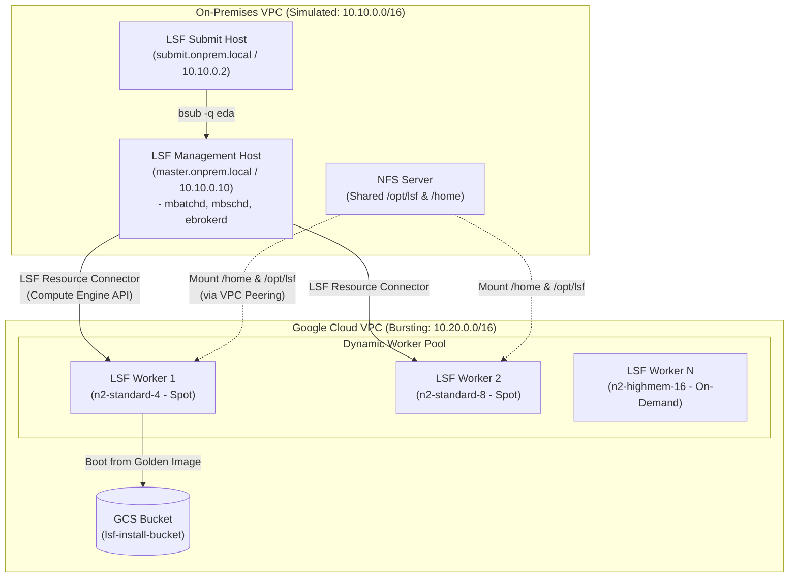
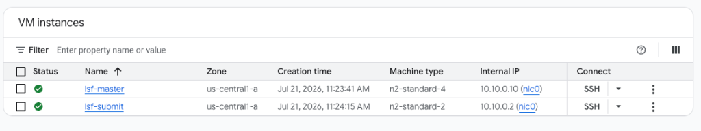
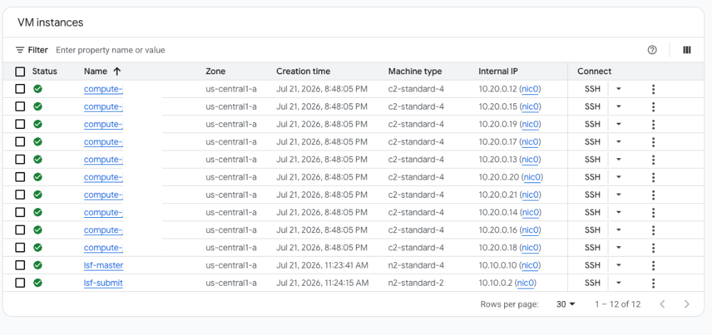

# Bursting Semiconductor EDA Workloads to Google Cloud with IBM Spectrum LSF

## Overview

Semiconductor and Electronic Design Automation (EDA) engineering teams routinely face spiky compute demand during tape-out milestones. While on-premises high-performance computing (HPC) clusters can handle baseline RTL simulation and synthesis, running massive multi-seed verification regressions or physical design sweeps often saturates local capacity and delays chip schedules.

In this hands-on lab, you build and operate a production-grade **Hybrid Cloud EDA Cluster** that bursts workloads from a simulated on-premises data center into **Google Cloud Platform (GCP)** using **IBM Spectrum LSF 10.1** and the **LSF Resource Connector for Google Cloud**.

You deploy the hybrid network and compute foundation with **Terraform**, bake a custom **Compute Engine Golden Image** pre-loaded with an open-source RTL-to-GDSII EDA toolchain (**Icarus Verilog**, **Yosys**, **Verilator**, **OpenROAD**, **Magic**, **Netgen**, and **GTKWave**), perform a fresh installation of **IBM Spectrum LSF 10.1 Service Pack 15** from staged Cloud Storage archives, dynamically burst **10 cloud worker VMs (20 concurrent slots)** on demand, and execute a **100-task parallel hardware verification regression array**.

---

## Objectives

In this lab, you learn how to perform the following tasks:

* Provision a hybrid cloud network topology (`lsf-onprem-vpc` and `lsf-cloud-vpc`) connected via **VPC Network Peering** and **Cloud DNS Peering** using **Terraform**.
* Build a pre-baked **Compute Engine Golden Image** (`lsf-submit-and-worker-rocky-8-image`) containing a complete open-source semiconductor EDA toolchain.
* Stage **IBM Spectrum LSF 10.1** installer archives and cluster configurations into **Cloud Storage** and bootstrap the **LSF Management (Master) Host** with shared **NFS** storage (`/opt/lsf` and `/home`).
* Configure the **IBM Spectrum LSF Resource Connector** (`googleprov_templates.json` and `lsb.queues`) to automatically burst pending batch jobs to **Google Compute Engine** Spot and On-Demand instances.
* Trigger and monitor a **10-instance (20-slot) dynamic cloud burst** and observe automatic scale-down when workloads complete.
* Execute RTL simulation (`iverilog` / `vvp`), logic synthesis (`yosys`), and a **100-task multi-seed EDA regression job array** across dynamically provisioned cloud workers.

---

## Hybrid Cloud Architecture

The lab environment replicates an enterprise hybrid semiconductor compute architecture across two peered Virtual Private Cloud (VPC) networks:

* **On-Premises VPC (Simulated — `lsf-onprem-vpc`, `10.10.0.0/16`)**: Hosts the static **LSF Management Host (`lsf-master`)** running the core scheduling daemons (`lim`, `res`, `sbatchd`, `mbatchd`, `mbschd`) and the Resource Connector broker (`ebrokerd`), an **NFS Server** exporting `/opt/lsf` and `/home`, and the **LSF Submission Host (`lsf-submit`)** where design engineers submit jobs.
* **Google Cloud Bursting VPC (`lsf-cloud-vpc`, `10.20.0.0/16`)**: Hosts the dynamic **Compute Engine Worker Pool** (`compute-*`), spun up on demand by the LSF Resource Connector when queue demand exceeds local capacity and terminated automatically after an idle timeout.
* **VPC Network Peering & Cloud DNS Peering**: Connects the two VPCs over private IP routing with forward (`c.<PROJECT_ID>.internal.`) and reverse (`20.10.in-addr.arpa.`) DNS peering so the on-premises LSF Master and dynamic cloud workers can mutually resolve hostnames and communicate over LSF ports (`7869`, `6878`, `6881`, `6882`) and NFS (`2049`).



---

## Setup and Requirements

### Before you click the Start Lab button

Read these instructions. Labs are timed and you cannot pause them. The timer, which starts when you click **Start Lab**, shows how long Google Cloud resources are made available to you.

This hands-on lab lets you do the lab activities in a real cloud environment, not in a simulation or demo environment. It does so by giving you new, temporary credentials that you use to sign in and access Google Cloud for the duration of the lab.

### Activate Cloud Shell

1. In the Google Cloud Console, click **Activate Cloud Shell** at the top right of the console window.
2. Click **Continue** when prompted.
3. Verify your authenticated account and active project ID:
   ```bash
   gcloud auth list
   gcloud config list project
   ```

### Clone the Workshop Repository

In Cloud Shell, clone the official Google Cloud LSF repository and navigate into the workspace root:

```bash
git clone https://github.com/GoogleCloudPlatform/lsf-google-cloud.git 2>/dev/null || git clone https://github.com/veloduff/lsf-google-cloud.git
cd lsf-google-cloud
```

---

## Task 1. Configure the Environment, Run Pre-Flight Checks, and Deploy Hybrid Cloud Infrastructure with Terraform

In this task, you configure your Terraform variables for your Qwiklabs project, run the automated pre-flight validation script, and deploy the hybrid VPCs, VPC Peering, Cloud NAT gateways, Cloud DNS Peering zones, IAM Service Account, Cloud Storage bucket, and simulated on-premises VMs (`lsf-master` and `lsf-submit`).

### 1. Generate `terraform/terraform.tfvars`

Run the following command in Cloud Shell to automatically detect your Qwiklabs Project ID, default Region, Zone, and the shared LSF installer source bucket, and write them to `terraform/terraform.tfvars`:

```bash
PROJECT_ID=$(gcloud config get-value project)
REGION=$(gcloud compute project-info describe --format="value(commonInstanceMetadata.items[google-compute-default-region])" 2>/dev/null)
REGION=${REGION:-us-central1}
ZONE=$(gcloud compute project-info describe --format="value(commonInstanceMetadata.items[google-compute-default-zone])" 2>/dev/null)
ZONE=${ZONE:-${REGION}-a}
SOURCE_BUCKET=$(gcloud compute project-info describe --format="value(commonInstanceMetadata.items[lsf_source_bucket])" 2>/dev/null)
SOURCE_BUCKET=${SOURCE_BUCKET:-qwiklabs-lsf-installers}

cat <<EOF > terraform/terraform.tfvars
project_id        = "${PROJECT_ID}"
region            = "${REGION}"
zone              = "${ZONE}"
lsf_source_bucket = "${SOURCE_BUCKET}"
EOF

cat terraform/terraform.tfvars
```

Export these variables into your current Cloud Shell session using the helper script:

```bash
source ./set_env.sh
```

### 2. Run the Pre-Flight Verification Script

Execute `./preflight.sh` to verify that `terraform` and `gcloud` are installed, your credentials and required Google Cloud APIs (`compute`, `dns`, `iam`, `storage`, `iamcredentials`) are active, and the shared LSF installer source bucket is configured:

```bash
./preflight.sh
```

Expected output:

```text
==================================================
LSF Hybrid Cloud: Pre-Flight Check
==================================================
1. Checking required CLI tools (terraform, gcloud)... PASSED
2. Checking Google Cloud authentication & ADC token... PASSED
3. Checking access to GCP Project 'qwiklabs-gcp-xx-xxxxxxxxxxxx'... PASSED
4. Verifying required GCP APIs (compute, dns, iam, storage)...
   -> API enabled: compute.googleapis.com
   -> API enabled: dns.googleapis.com
   -> API enabled: iam.googleapis.com
   -> API enabled: storage.googleapis.com
   -> API enabled: iamcredentials.googleapis.com
5. Checking for LSF installer archives (Install_Files/ or shared GCS bucket)... PASSED
==================================================
ALL PRE-FLIGHT CHECKS PASSED!
You are ready to deploy: cd terraform && terraform init && terraform apply
==================================================
```

### 3. Deploy the Hybrid Cloud Infrastructure with Terraform

Navigate to the `terraform/` directory, initialize Terraform providers, and apply the configuration:

```bash
cd terraform
terraform init
terraform apply -auto-approve
cd ..
```

Terraform provisions 21 resources, including:
* **`lsf-onprem-vpc`** (`10.10.0.0/16`) and **`lsf-cloud-vpc`** (`10.20.0.0/16`) with bidirectional VPC Network Peering.
* **Cloud Routers & Cloud NAT** in both VPCs so private VMs without external IPs can install packages securely.
* **Cloud DNS Peering Zones** (`cloud-dns-peering` for forward resolution of `.c.<PROJECT_ID>.internal.` and `cloud-reverse-dns-peering` for reverse lookup of `10.20.x.x`).
* **Firewall Rules** locking SSH down to Identity-Aware Proxy (`35.235.240.0/20`) and opening LSF ports (`7869`, `6878`, `6881`, `6882`) and NFS (`2049`) across peered VPCs.
* **Service Account** (`lsf-resource-connector-sa`) with Compute Admin and Storage Object Viewer permissions.
* **Cloud Storage Bucket** (`lsf-install-bucket-*`) for staging LSF installers, configs, and EDA workflows.
* **On-Premises Simulation VMs**: `lsf-master` (`10.10.0.10`) and `lsf-submit` (`10.10.0.2`).

Click **Check my progress** to verify the objective.

<ql-activity-tracking step="1">
Deploy Hybrid Cloud VPCs, Peering, Cloud DNS, GCS Bucket, and On-Premises VMs with Terraform
</ql-activity-tracking>

---

## Task 2. Build the Pre-Baked EDA Worker Golden Image

When LSF bursts pending EDA jobs into Google Cloud, dynamic worker instances need to boot and join the cluster in seconds without spending several minutes downloading compilers and EDA packages on every launch.

In this task, you run the automated Golden Image builder (`./lsf_config/build_golden_image.sh`) to bake a custom Compute Engine image named **`lsf-submit-and-worker-rocky-8-image`** (image family `lsf-rocky-8`).

### What gets baked into the Golden Image?
1. **OS Packages**: `nfs-utils`, `ed`, `epel-release`, `libnsl`, `java-1.8.0-openjdk-headless`, `wget`.
2. **Miniconda3 Environment (`/opt/conda/envs/eda`)** with the open-source RTL-to-GDSII toolchain:
   * **Simulation**: `iverilog` (Icarus Verilog), `verilator`
   * **Logic Synthesis**: `yosys`
   * **Place & Route**: `openroad`
   * **VLSI Layout & LVS**: `magic`, `netgen`
   * **Waveform Viewer**: `gtkwave`

*(Note: LSF binaries are **not** duplicated inside the worker image—instead, dynamic workers mount `/opt/lsf` and `/home` directly from `lsf-master` over NFS on boot, ensuring any LSF configuration or patch changes on the master take effect immediately.)*

### 1. Run the Automated Golden Image Builder

From the repository root in Cloud Shell, execute the image builder script:

```bash
./lsf_config/build_golden_image.sh
```

> **Note:** This process takes approximately **5 to 7 minutes**. The script launches a temporary `n2-standard-4` builder VM (`lsf-golden-build`), installs the OS prerequisites and Conda EDA packages via IAP SSH, stops the instance, captures the boot disk as `lsf-submit-and-worker-rocky-8-image`, and deletes the temporary VM.

### 2. Verify the Custom Image in Compute Engine

Once the script completes, confirm that `lsf-submit-and-worker-rocky-8-image` is registered and `READY`:

```bash
gcloud compute images list --filter="name=lsf-submit-and-worker-rocky-8-image"
```

Expected output:

```text
NAME                                 PROJECT                       FAMILY       DEPRECATED  STATUS
lsf-submit-and-worker-rocky-8-image  qwiklabs-gcp-xx-xxxxxxxxxxxx  lsf-rocky-8              READY
```

Click **Check my progress** to verify the objective.

<ql-activity-tracking step="2">
Build the Pre-Baked EDA Worker Golden Image (lsf-submit-and-worker-rocky-8-image)
</ql-activity-tracking>

---

## Task 3. Stage LSF Installers from Shared Cloud Storage and Bootstrap the LSF Master Node

In this task, you perform a fresh installation of **IBM Spectrum LSF 10.1 (with Service Pack 15)** by staging the 4 LSF installer archives from the lab's shared Cloud Storage bucket into your project's installation bucket (`gs://lsf-install-bucket-*`), along with the cluster configuration files and EDA workflows. You then connect to `lsf-master` and run the automated master bootstrap script.

### 1. Stage LSF Installers, Configurations, and Workflows to Cloud Storage

From the repository root in Cloud Shell, run `./upload_assets.sh`:

```bash
./upload_assets.sh
```

Because `lsf_source_bucket` is configured in `terraform/terraform.tfvars`, `upload_assets.sh` automatically copies the 4 required LSF archives from the shared GCS bucket directly into your project's `gs://lsf-install-bucket-*` bucket and uploads the `lsf_config/`, `eda_workflow/`, and `submit_scripts/` directories:

```text
==================================================
LSF Hybrid Cloud: Uploading Assets to GCS
==================================================
Retrieving GCS bucket name from Terraform output...
Target bucket: gs://lsf-install-bucket-xxxxxxxx
Checking LSF installation status on master VM...
 -> LSF is not detected on master VM. Checking installer sources...
Staging LSF installer archives from shared GCS source bucket: gs://qwiklabs-lsf-installers/...
 -> Copying gs://qwiklabs-lsf-installers/lsf10.1_lsfinstall_linux_x86_64.tar.Z...
 -> Copying gs://qwiklabs-lsf-installers/lsf10.1_lnx310-lib217-x86_64.tar.Z...
 -> Copying gs://qwiklabs-lsf-installers/lsf_std_entitlement.dat...
 -> Copying gs://qwiklabs-lsf-installers/lsf10.1_lnx310-lib217-x86_64-602430.tar.Z...
All 4 LSF installer archives staged from gs://qwiklabs-lsf-installers/!
Uploading LSF configuration directory...
Uploading EDA sample workflow directory...
Uploading Submit & Scaling test scripts directory...
==================================================
ALL ASSETS UPLOADED SUCCESSFULLY TO:
gs://lsf-install-bucket-xxxxxxxx/
==================================================
```

### 2. Connect to `lsf-master` and Run `setup_master.sh`

SSH into the `lsf-master` VM over Identity-Aware Proxy (IAP) using the provided helper script:

```bash
./ssh_master.sh
```

Once connected to `lsf-master`, download the `lsf_config/` folder from your project's GCS bucket and execute `setup_master.sh` as `root`:

```bash
BUCKET_NAME=$(curl -s -H "Metadata-Flavor: Google" http://metadata.google.internal/computeMetadata/v1/instance/attributes/lsf_bucket)
gcloud storage cp -r "gs://${BUCKET_NAME}/lsf_config" ./
sudo bash ./lsf_config/setup_master.sh
```

What `setup_master.sh` performs automatically:
1. Downloads the 4 LSF 10.1 archives (`lsf10.1_lsfinstall_linux_x86_64.tar.Z`, `lsf10.1_lnx310-lib217-x86_64.tar.Z`, `lsf10.1_lnx310-lib217-x86_64-602430.tar.Z`, and `lsf_std_entitlement.dat`) from `gs://${BUCKET_NAME}/`.
2. Runs silent `./lsfinstall -f install.config` into `/opt/lsf` (which is NFS-exported to `10.10.0.0/16` and `10.20.0.0/16`).
3. Applies cumulative **Service Pack 15** (`./patchinstall`) to enable the Google Cloud Resource Connector (`ebrokerd`).
4. Populates `/opt/lsf/conf/` with `lsf.conf`, `lsf.shared`, `lsf.cluster.eda_cluster`, `lsb.queues`, `lsb.hosts`, `lsb.resources`, `hostProviders.json`, `googleprov_config.json`, and `googleprov_templates.json`, dynamically substituting your Project ID, Region, Zone, and `lsf-submit-and-worker-rocky-8-image`.
5. Copies `eda_workflow/` and `submit_scripts/` into `/home/lsfadmin/` (shared via NFS to `lsf-submit` and all dynamic workers).
6. Configures SUID root permissions on `eauth` and starts `lim`, `res`, and `sbatchd`.

### 3. Verify the LSF Master Cluster Status

Still on `lsf-master`, source the LSF profile and verify that the cluster and queues are online:

```bash
source /opt/lsf/conf/profile.lsf
lsid
bhosts
bqueues
```

Expected output:

```text
IBM Spectrum LSF Standard 10.1.0.15, Jun 14 2024
Copyright International Business Machines Corp. 1992, 2016.
US Government Users Restricted Rights - Use, duplication or disclosure
restricted by GSA ADP Schedule Contract with IBM Corp.

My cluster name is eda_cluster
My master name is master

HOST_NAME          STATUS       JL/U    MAX  NJOBS    RUN  SSUSP  USUSP    RSV
master             ok              -      4      0      0      0      0      0

QUEUE_NAME      PRIO STATUS          MAX JL/U JL/P JL/H NJOBS  PEND   RUN  SUSP
eda              30  Open:Active       -    -    -    -     0     0     0     0
normal           20  Open:Active       -    -    -    -     0     0     0     0
```

Exit the `lsf-master` SSH session to return to Cloud Shell:

```bash
exit
```

Click **Check my progress** to verify the objective.

<ql-activity-tracking step="3">
Stage LSF Installers from Shared Cloud Storage and Bootstrap the LSF Master Node
</ql-activity-tracking>

---

## Task 4. Trigger Dynamic Cloud Bursting and Auto-Scaling (10 Workers / 20 Slots)

In this task, you log into the **LSF Submission Host (`lsf-submit`)** as an EDA engineer (`lsfadmin`), inspect how the `eda` queue and Resource Connector templates are configured, and submit a 20-slot parallel batch workload that triggers LSF to dynamically provision **10 `n2-standard-4` Spot VM workers** in `lsf-cloud-vpc`.

### 1. Connect to `lsf-submit` and Switch to `lsfadmin`

From Cloud Shell, SSH into `lsf-submit`:

```bash
./ssh_submit.sh
```

Switch to the `lsfadmin` user and source the LSF environment (mounted over NFS from `lsf-master`):

```bash
sudo su - lsfadmin
source /opt/lsf/conf/profile.lsf
```

### 2. Inspect the Resource Connector Queue and VM Templates

View the `eda` queue definition in `/opt/lsf/conf/lsbatch/eda_cluster/configdir/lsb.queues`:

```bash
cat /opt/lsf/conf/lsbatch/eda_cluster/configdir/lsb.queues
```

Notice the two directives that enable cloud bursting on the `eda` queue:
* `RC_HOSTS = googlehost`: Allows the queue to borrow hosts exposing the `googlehost` boolean resource from the Google Cloud Resource Connector.
* `RC_DEMAND_POLICY = THRESHOLD[[1, 1]]`: Triggers cloud bursting as soon as 1 job remains pending for 1 minute.

Next, inspect the first template (`gcp-eda-sim-spot`) in `/opt/lsf/conf/resource_connector/google/conf/googleprov_templates.json`:

```bash
head -n 30 /opt/lsf/conf/resource_connector/google/conf/googleprov_templates.json
```

Notice that `gcp-eda-sim-spot` provisions `n2-standard-4` Spot instances in `lsf-cloud-vpc` / `lsf-cloud-subnet` using your pre-baked `lsf-submit-and-worker-rocky-8-image`, exposing `ncpus = 2` slots per VM.

### 3. Submit a 20-Slot Cloud Bursting Job

Navigate to `/home/lsfadmin/submit_scripts` and run `./submit_scale_10.sh`:

```bash
cd /home/lsfadmin/submit_scripts
./submit_scale_10.sh
```

This submits a parallel job (`bsub -R "select[googlehost]" -q eda -J scale_10_hosts -n 20 sleep 900`) requesting **20 concurrent slots** with the `googlehost` resource requirement. Because each `n2-standard-4` worker template provides 2 slots, LSF Resource Connector immediately requests **10 Compute Engine worker VMs** in parallel.

### 4. Monitor Dynamic Cloud Provisioning

Check the pending reason and Resource Connector host allocation status:

```bash
bjobs -p
bhosts -rc
```

You can also launch the live auto-scaling dashboard script (press **`Ctrl+C`** after a minute or two to exit the monitor):

```bash
./monitor_scaling.sh
```

Within 60–90 seconds, the 10 dynamic cloud worker instances (`compute-*`) boot from your Golden Image, mount `/opt/lsf` and `/home` via NFS across the VPC peering link, register with `lsf-master`, and transition the job from `PEND` to `RUN`:

* **Idle Cluster Baseline** (only `lsf-master` and `lsf-submit` running in `10.10.0.0/16`):
  

* **Dynamically Scaled Cluster** (10 `compute-*` worker VMs provisioned in `10.20.0.0/16`):
  

Verify that `bhosts` lists the dynamic `compute-*` worker nodes:

```bash
bhosts
```

Click **Check my progress** to verify the objective.

<ql-activity-tracking step="4">
Trigger Dynamic Cloud Bursting and Auto-Scaling (10 Workers / 20 Slots) with LSF Resource Connector
</ql-activity-tracking>

### 5. Optional: Free Slots for the EDA Regression Suite

Once you have verified that your `scale_10_hosts` job is running (and passed the progress check above), you can terminate the `sleep 900` job so those warm cloud worker VMs are immediately available to run your EDA simulation and synthesis tasks in Task 5 without waiting for new VMs to boot:

```bash
bkill -J scale_10_hosts
```

---

## Task 5. Run Verilog Simulation, Yosys Logic Synthesis, and a 100-Task Multi-Seed Regression Sweep

In this task, you execute a real semiconductor digital design workflow across your hybrid LSF cluster:
1. Compile and simulate a 4-bit synchronous Verilog counter (`counter.v`) and self-checking testbench (`counter_tb.v`) using **Icarus Verilog (`iverilog` / `vvp`)** to generate a waveform dump (`counter.vcd`).
2. Synthesize the RTL design into a gate-level netlist (`counter_synth.v`) using **Yosys (`yosys`)**.
3. Dispatch a **100-task multi-seed regression sweep** (`-J "eda_regress[1-100]"`) across the dynamic Google Cloud worker pool.

### 1. Test the EDA Toolchain Locally on `lsf-submit`

Still logged in as `lsfadmin` on `lsf-submit`, navigate to `/home/lsfadmin/eda_workflow` and inspect the Verilog design files:

```bash
cd /home/lsfadmin/eda_workflow
ls -la
```

Run `./run_eda_job.sh` locally on `lsf-submit` to verify that `iverilog`, `vvp`, and `yosys` compile, simulate, and synthesize the counter cleanly:

```bash
./run_eda_job.sh
```

Expected output snippet:

```text
--- Step 1: Running Verilog Simulation ---
VCD info: dumpfile counter.vcd opened for output.
At time                    0: rst_n=0, enable=0, count= 0
...
At time               175000: rst_n=1, enable=1, count=15
SUCCESS: Counter testbench passed! Final count is 15
Simulation completed successfully. Generated counter.vcd.
--- Step 2: Running Logic Synthesis ---
...
Synthesis completed successfully. Generated counter_synth.v.
==================================================
EDA Job Completed Successfully!
==================================================
```

Verify that `counter.vcd` and `counter_synth.v` were generated in `/home/lsfadmin/eda_workflow/`:

```bash
ls -lh counter.vcd counter_synth.v
```

### 2. Submit a Single Cloud-Bursted EDA Job

Now submit the EDA workflow to the `eda` queue on a dynamic Google Cloud worker reserving 8 GB of memory (`-R "select[googlehost] rusage[mem=8192]"`):

```bash
./submit_eda_job.sh
bjobs
```

### 3. Launch a 100-Task Parallel Multi-Seed Regression Sweep

In semiconductor verification, engineers run hundreds of simulations with different random seeds (`+seed=$SEED`) in parallel. Run `./submit_regression.sh` to submit a 100-element LSF Job Array (`-J "eda_regress[1-100]"`):

```bash
./submit_regression.sh
```

Monitor the job array summary and active tasks across your dynamic cloud workers:

```bash
bjobs -A
bjobs
```

As tasks complete on the cloud workers, each array index writes its isolated simulation waveform (`counter.vcd`), synthesis log (`synthesis.log`), and gate-level netlist (`counter_synth.v`) to `/home/lsfadmin/eda_workflow/runs/run_<INDEX>/` on the shared NFS filesystem.

Verify that regression run directories have been populated:

```bash
ls -la /home/lsfadmin/eda_workflow/runs/ | head -n 20
ls -la /home/lsfadmin/eda_workflow/runs/run_1/
```

Click **Check my progress** to verify the objective.

<ql-activity-tracking step="5">
Run Verilog Simulation, Yosys Logic Synthesis, and a 100-Task Multi-Seed Regression Array
</ql-activity-tracking>

---

## Congratulations!

You have successfully deployed a hybrid semiconductor EDA environment on Google Cloud with Terraform, built a custom Compute Engine Golden Image with an open-source RTL-to-GDSII toolchain, installed IBM Spectrum LSF 10.1 with the Google Cloud Resource Connector, dynamically bursted 10 cloud worker instances, and executed a 100-task parallel hardware verification regression sweep!

### What We Covered
* **Hybrid Cloud Networking**: Connecting simulated on-premises and cloud bursting VPCs using VPC Network Peering, Cloud NAT, and Cloud DNS Peering.
* **Golden Image Engineering**: Pre-baking EDA tools (`iverilog`, `yosys`, `verilator`, `openroad`, `magic`, `netgen`, `gtkwave`) into a Compute Engine custom image while sharing `/opt/lsf` and `/home` over NFS.
* **Policy-Driven Cloud Bursting**: Configuring LSF Resource Connector templates (`googleprov_templates.json`) and queue demand policies (`lsb.queues`) to automatically provision and deprovision GCE Spot and On-Demand VMs.
* **High-Throughput EDA Verification**: Running parallel RTL simulations and logic synthesis sweeps using LSF Job Arrays.
